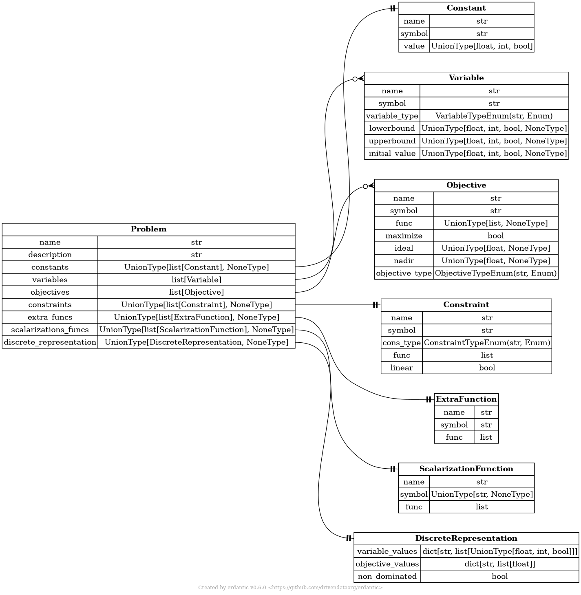
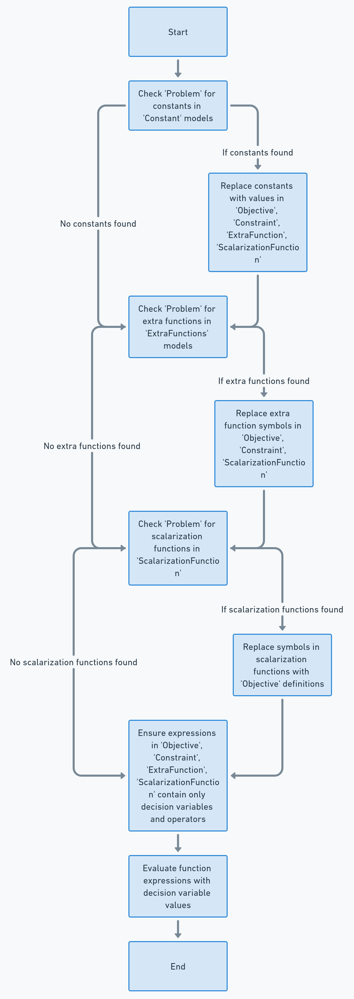

# Defining and evaluating problems

## The MathJSON format

TODO:

- Explain the MathJSON format and how it is used to store function expressions.

## The Problem schema

### Problem

!!! Note
    The `Problem` model and all its field are **immutable**. The only exception to this
    is the `symbol` field of the `ScalarizationFunction` models. 

Multiobjective optimization problems are represented by models stored in JSON files.
The schema of the models have been defined utilizing pydantic. The main
model storing information related to a multiobjective optimization is the
`Problem` model, which consists of other models. The relational map of the
`Problem` model, and the models contained therein, has been visualized below:



The `Problem` model consists of various fields: the name of the problem (**name**), the
description of the problem (**description**), a list of constant utilized in the definition of the
problem (**constants**), a list of the variables of the problem (**variables**), a list of the
objective functions of the problem (**objectives**), an optional list of the constraints of the problem
(**constraints**), an optional list of extra functions utilized in defining the problem (**extra_funcs**),
an optional list of scalarized representations of the problem (**scalarization_funcs**), and an optional list
of evaluated solutions of the problem (**evaluated_solutions**).

The **name** and **description** of the problem are just strings. The other fields consist of one or
more additional models, which will be described next.

!!! Note
    The `symbol` entries across all fields must be unique. If one or more non-unique symbols are
    defined, `Problem` will raise an error when being initialized.

!!! Note
    The `symbol` `scal_i`, where `i` is any positive integer, is reserved and should not be used as a symbol
    in any model with a `symbol` field. The `scal_i` pattern is used to generate symbols for instances of
    `ScalarizationFunction` that have a default symbol of `None`.  

### Constant

The `Constant` model defines a constant with a name, symbol and a value. Its JSON
schema looks as follows:

<details>
<summary><b>Click to expand</b></summary>

```json
{{ get_constant_info()[0] }}
```
</details>
</br>

and an example of the JSON object corresponding to the schema looks like:

<details>
<summary><b>Click to expand</b></summary>

```json
{{ get_constant_info()[1] }}
```
</details>
</br>

### Variable

The `Variable` model defines a decision variable with a name, symbol, variable type, lower and upper
bounds, and an initial values. Its JSON schema looks as follows:

<details>
<summary><b>Click to expand</b></summary>

```json
{{ get_variable_info()[0]}}
```
</details>
</br>

and an example of the JSON object corresponding to the schema looks like:

<details>
<summary><b>Click to expand</b></summary>

```json
{{ get_variable_info()[1]}}
```
</details>
</br>

### Objective

The `Objective` model defines an objective function with a name, symbol, function expression, whether the function is
to be maximized or not, and the function's ideal and nadir value. Its JSON schema looks as follows:

<details>
<summary><b>Click to expand</b></summary>

```json
{{ get_objective_info()[0] }}
```
</details>
</br>

and an example of a JSON object corresponding to the schema looks like:

<details>
<summary><b>Click to expand</b></summary>

```json
{{ get_objective_info()[1] }}
```
</details>
</br>

!!! note
    The `func` entry in the JSON object of the objective model must adhere to the MathJSON format.

### Constraint

The `Constraint` model defines a constraint function with a name, symbol, and function expression. Its JSON schema looks as follows:

!!! note
    The constraint must be expected in a standard format where the function expression of the constraint is on the left hand side of an
    inequality expression, and on the right hand side a zero is assumed. Likewise, for equality constraints, the left hand side has a function
    expression that must be equal to zero. In other words, a constraint, such as `x_1 <= 5` must first be expressed as `x_1 - 5 <= 0`, and then the
    constraint expression supplied to the `Constraint` model would be `x_1 - 5`. Likewise, an equality constraint, such as `x_1 + x_2 == 5` would be first
    expressed as `x_1 + x_2 - 5 == 0`, and the supplied function expression would be `x_1 + x_2 - 5`.

<details>
<summary><b>Click to expand</b></summary>

```json
{{ get_constraint_info()[0]}}
```
</details>
</br>

and an example of a JSON object corresponding to the schema looks like:

<details>
<summary><b>Click to expand</b></summary>

```json
{{ get_constraint_info()[1]}}
```
</details>
</br>

!!! note
    The `func` entry in the JSON object of the constraint model must adhere to the MathJSON format.

### ExtraFunction

The `ExtraFunction` model defines any functions utilized in the definition of the problem. The extra function has a name,
symbol, and function expression. Its JSON schema looks as:

<details>
<summary><b>Click to expand</b></summary>

```json
{{ get_extra_function_info()[0]}}
```
</details>
</br>

and an example of a JSON object corresponding to the schema looks like:

<details>
<summary><b>Click to expand</b></summary>

```json
{{ get_extra_function_info()[1]}}
```
</details>
</br>

!!! note
    The `func` entry in the JSON object of the extra function model must adhere to the MathJSON format.

### ScalarizationFunction

!!! Note
    The `symbol` of `ScalarizationFunction` is optional. If not defined, a symbol will be generated for each
    scalarization function with no symbol provided. These symbols follow a systematic pattern `scal_i`, where
    `i` is a runnin index local to each instance of `Problem`. When adding new scalarization functions, the
    method `Problem.add_scalarization` should be utilized to ensure the correct default generation of symbols
    for instance of `ScalarizationFunction`.

The `ScalarizationFunction` model defines any scalarizations of the problem being solved. The scalarization
function has a name and a function definition. Its JSON schema looks as follows:

<details>
<summary><b>Click to expand</b></summary>

```json
{{ get_scalarization_function_info()[0]}}
```
</details>
</br>

and an example of a JSON object corresponding to the schema looks like:

<details>
<summary><b>Click to expand</b></summary>

```json
{{ get_scalarization_function_info()[1]}}
```
</details>
</br>

!!! note
    The `func` entry in the JSON object of the scalarization function model must adhere to the MathJSON format.

### EvaluatedInfo

The `EvaluatedInfo` model defines information related to one or more evaluated solutions to the problem. It contains
infor about the source of the solution (e.g., which method has been used to compute it) and, in case the information
describes multiple solutions, whether the solutions are mutually dominated or not. The model's JSON schema looks as
follows:

<details>
<summary><b>Click to expand</b></summary>

```json
{{ get_evaluated_info_info()[0] }}
```
</details>
</br>

and an example of a JSON object corresponding to the schema looks like:

<details>
<summary><b>Click to expand</b></summary>

```json
{{ get_evaluated_info_info()[1] }}
```
</details>
</br>

### EvaluatedSolutions

The `EvaluatedSolutions` model defines one or more evaluated decision vectors and their corresponding objective vectors. The model
contains also information on the evaluated solutions. Its JSON schema looks as follows:

<details>
<summary><b>Click to expand</b></summary>

```json
{{ get_evaluated_solutions_info()[0] }}
```
</details>
</br>

and an example of a JSON object corresponding to the schema looks like:

<details>
<summary><b>Click to expand</b></summary>

```json
{{ get_evaluated_solutions_info()[1] }}
```

</details>
</br>

## Parsing and Evaluation

!!! TODO
    Currently it is assumed that the symbol for any scalarization function is given. In fact, if it is not given
    (it is optional in the schema), the evaluator will not work as intended. Generating a symbol for
    scalarization functions without a defined symbol should be implemented.

The problem defined in a `Problem` model is parsed into polars expressions that can be numerically evaluated.
Parsing is done according to the following logic described below.

### Initialization

1. **Create Math Parser**: Initialize a math parser of a specified type. The
   default is a polars parser.
2. **Constant Replacement**: Examine a given instance of a `Problem` model for any
   instances of `Constant`.
   If found, replace these constants with their numerical values across all
   function expressions within the problem model.
3. **Function Expression Parsing**: Convert the function expressions
   found in the `Objective`, `Constraint`, `ExtraFunction`, `ScalarizationFunction` models of the problem
   into a structured format, a dataframe in case of the default polars parser, for easier
   manipulation and evaluation.

### Evaluating

1. **Extra Functions Evaluation**: If any extra functions are defined, evaluate
   them using specified decision variables. Store the outcomes in new columns within the
   dataframe, with the symbol of the corresponding extra function as the column
   name.
2. **Objective Functions Evaluation**: Evaluate the objective functions based on
   the decision variables and any values derived from extra functions (already evaluated and stored
   in the dataframe). Store these
   results in separate columns of the dataframe. The new columns are named with the symbol
   defined for each objective function.
3. **Constraints Evaluation**: Evaluate the constraints, if any are present,
   considering the decision variables and any computed extra function values. Store these
   in the dataframe. The new columns are named with the symbol defined for each constraint.
4. **Scalarization Functions Evaluation**: If scalarization functions are
   defined, evaluate them using the values obtained from objective functions and
   extra functions. Store these results in the dataframe in columns named with the
   name of the scalarization function.
5. **Result Compilation**: Compile a pydantic dataclass encapsulating all
   results, including decision variables, values of objective functions,
   constraints, and scalarization functions. Return the instance of the dataclass.

The flow of the parsing logic has been visualized below:

