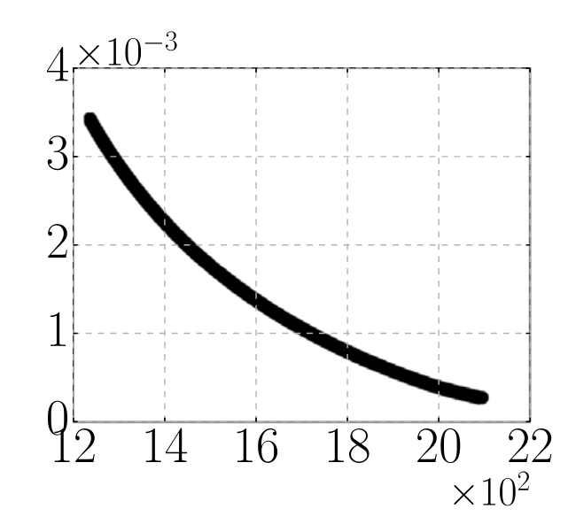
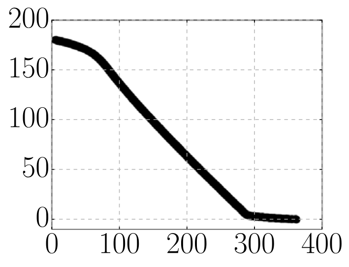

# Test problems

In DESDEO, some known test problem have been implemented and may be used to test the framework and the optimization methods implemented in it.
Here, some of those test problems are introduced and described.

## The four bar truss design problem (RE21)

The four bar truss design problem [1] has, as its two objective funtions, structural volume and joint displacement, and areas of member cross-sections as the four decision variables. The decision variables are constrained has four constraints related to member stresses. The variables are continuous and the problem's Pareto front is convex.

The objective functions and constraints for the four bar truss design problem are defined as follows:

$$\begin{align}
    &\min_{\mathbf{x}} & f_1(\mathbf{x}) & = L(2x_1 + \sqrt{2}x_2 + \sqrt{x_3} + x_4) \\
    &\min_{\mathbf{x}} & f_2(\mathbf{x}) & = \frac{FL}{E}\left(\frac{2}{x_1} + \frac{2\sqrt{2}}{x_2}
    - \frac{2\sqrt{2}}{x_3} + \frac{2}{x_4}\right) \\
    &\text{s.t.,}   & \frac{F}{\sigma} \leq x_1 & \leq 3\frac{F}{\sigma},\\
    & & \sqrt{2}\frac{F}{\sigma} \leq x_2 & \leq 3\frac{F}{\sigma},\\
    & & \sqrt{2}\frac{F}{\sigma} \leq x_3 & \leq 3\frac{F}{\sigma},\\
    & & \frac{F}{\sigma} \leq x_4 & \leq 3\frac{F}{\sigma},\\
\end{align}$$

where $x_1, x_4 \in [a, 3a]$, $x_2, x_3 \in [\sqrt{2}a, 3a]$, and $a = F/\sigma$. The parameters are defined as $F = 10$ $kN$, $E = 2e^5$ $kN/cm^2$, $L = 200$ $cm$, and $\sigma = 10$ $kN/cm^2$.

Here is an approximation of the four bar truss design problem's Pareto front (taken from [2]), where the $x$ and $y$ axes represent the values of the objective functions $f_1$ and $f_2$ respectively:

## The reinforced concrete beam design problem (RE22)

In the reinforced concrete beam design problem [3], the first objective is to minimize the total cost of concrete and reinforcing steel of the beam. The second object is to minimize the sum of the two constraint violations. The decision variable $x_1$ has a predefined discrete value[^1] from 0.2 to 15. That makes the decision variables a mix of continuous and discrete variables.

The objective functions and constraints for the reinforced concrete beam design problem are defined as follows:

$$\begin{align}
    &\min_{\mathbf{x}} & f_1(\mathbf{x}) & = 29.4x_1 + 0.6x_2x_3 \\
    &\min_{\mathbf{x}} & f_2(\mathbf{x}) & = \sum_{i=1}^2 \max\{g_i(\mathbf{x}), 0\} \\
    &\text{s.t.,}   & g_1(\mathbf{x}) & = x_1x_3 - 7.735\frac{x_1^2}{x_2} - 180 \geq 0,\\
    & & g_2(\mathbf{x}) & = 4 - \frac{x_3}{x_2} \geq 0,
\end{align}$$

where $x_2 \in [0,20]$ and $x_3 \in [0,40].$

Here is an approximation of the reinforced concrete beam design problem's Pareto front (taken from [2]), where the $x$ and $y$ axes represent the values of the objective functions $f_1$ and $f_2$ respectively:

## References
[1]: Cheng, F. Y., & Li, X. S. (1999). Generalized center method for multiobjective engineering optimization. Engineering Optimization, 31(5), 641-661.

[2]: Tanabe, R. & Ishibuchi, H. (2020). An easy-to-use real-world multi-objective optimization problem suite. Applied soft computing, 89, 106078. https://doi.org/10.1016/j.asoc.2020.106078.

[3]: Amir, H. M., & Hasegawa, T. (1989). Nonlinear mixed-discrete structural optimization. Journal of Structural Engineering, 115(3), 626-646.

[^1]: A set of predefined discrete values for the first decision variable: {0.2, 0.31, 0.4, 0.44, 0.6, 0.62, 0.79, 0.8, 0.88, 0.93, 1, 1.2, 1.24, 1.32, 1.4, 1.55, 1.58, 1.6, 1.76, 1.8, 1.86, 2, 2.17, 2.2, 2.37, 2.4, 2.48, 2.6, 2.64, 2.79, 2.8, 3, 3.08, 3, 1, 3.16, 3.41, 3.52, 3.6, 3.72, 3.95, 3.96, 4, 4.03, 4.2, 4.34, 4.4, 4.65, 4.74, 4.8, 4.84, 5, 5.28, 5.4, 5.53, 5.72, 6, 6.16, 6.32, 6.6, 7.11, 7.2, 7.8, 7.9, 8, 8.4, 8.69, 9, 9.48, 10.27, 11, 11.06, 11.85, 12, 13, 14, 15}.