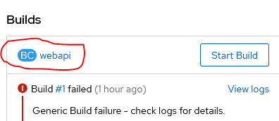
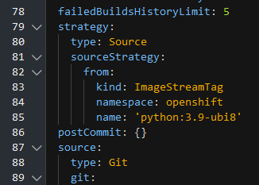

# How to host a DESDEO web application on Kubernetes

This is a how-to guide to setting up a DESDEO web application on Kubernetes. Specifically, the aim is to provide one easy way to get desdeo-webapi, desdeo-webui and a database running on [CSC Rahti](https://docs.csc.fi/cloud/rahti2/). Rahti is running Openshift OKD v4 with Kubernetes v1.28. If you are trying to host your web application somewhere else, all the steps presented here might not be directly applicable, but the process should be similar.

## Getting started on Rahti

The first thing to do, is to create a project for your web application. To be able to do that on Rahti, you will first need CSC computing project to associate it with. See the [Rahti documentation](https://docs.csc.fi/cloud/rahti2/access/) on how to create one.

The next step is to login to the [Rahti web interface](https://console-openshift-console.apps.2.rahti.csc.fi/). Once you are in, look for a `create project` button. You will likely need to be in the administrator role to see it. Input the name of the of the project, add a display name if you want one, and add a description. In Rahti the name of the project is kind of important, because it will appear as a part of all the automatically generated URLs pointing to your web application, so you will want to choose something short and to the point. In the description you will need to include the Project Number of your CSC computing project in format `csc_project:1234567`.
!!! Note
    It will take some time for the Rahti system to become aware of newly created computing projects. If you just created a new computing project and are getting an error when creating a Rahti project, just wait and it should sort itself out.

Once you have your project set up, you can start adding resources to your project.

## DESDEO webapi

To add a new resource i.e. piece of your web application, navigate to the `+Add` page. There, you want to choose `Import from Git` option. 

First, you will need to input a Github adress to the repository that contains your DESDEO webapi code, for example `https://github.com/industrial-optimization-group/DESDEO`. You are unlikely to be using the main branch of the Git for your deployment, so click `Show advanced Git options` and add the name of your desired branch under `Git reference`. You probably don't need to touch any of the other advanced options.

At this point, the system should have automatically figured out that you want to host a Python application and chosen you an appropriate `Builder Image version`. But if not, you can set it up manually. 
!!! Note
      At the time of writing this, Rahti does not support Python versions newer than 3.9, and DESDEO2 uses Python 3.12. 
If you need to use a builder image that is not available on Rahti or need to customize the build image to add support for different solvers, for example, just use Python 3.9 to create the build configuration, and then change it later to use a [different build image](#adding-a-custom-build-image).

Under the **General** section, you can choose the name of your application, which does not matter much, because it will not be visible outside the administrative interface, and the `Name` of your application component, which is kind of important, because it will be part of any URL pointing to that component. For the webapi it does not matter too much what you choose, but put some thought into what you name the webui, because your users are connecting to that part and can see the name.

Under **Build** section you may want to adjust the advanced Build options, because that is the place to set up Environment variables that are present both during the build and while the application is running. This is a good way to tell your DESDEO webapi, for example, where to find the database it is supposed to connect to. You can either list the environment variables directly here or use a secret on Kubernetes.

DESDEO2 uses the following Environment variables to get information about the database and the webui:
```
POSTGRES_USER       # This is the username for the database
POSTGRES_PASSWORD   # This is the password for the database
POSTGRES_HOST       # This is the host of the database
POSTGRES_PORT       # This is the port used by the host
POSTGRES_DB         # This is the name of the database
CORS_ORIGINS        # This is a list of potential URLs where the webui might be hosted
```
The `CORS_ORIGINS` variable is used to list the web sites for [Cross-origin resource sharing](https://en.wikipedia.org/wiki/Cross-origin_resource_sharing). It should list all the URLs where you might want to host your frontend. It should be in the format of a list of JSON string. For example, the default value if the environment variable is not set is `["http://localhost", "http://localhost:8080", "http://localhost:5173"]`

You can also define other environment variables here or in your [S2I](#source-to-image-s2i) scripts. Your S2I scripts are not suited for storing sensitive information like database usernames and passwords, because they are typically uploaded on Github with your code.

You will likely not need to touch anything under **Deploy** or **Advanced Options** for now. When you are done with your adjustments, click `Create` and the system will attempt to download your source code from the specified location, build a docker image, and finally run it.

## Source to image (S2I)

The way Rahti transforms the code on Github to a web application is by using [Source-to-Image (S2I)](https://github.com/openshift/source-to-image) toolkit. You probably don't need to be familiar with its more intricate workings, but there is a lot of documentation and examples available online if you need it. To put simply, what S2I does is it

1. bundles up your code excluding the files defined in `.s2iignore` file,

2. sets the environment variables from `.s2i/environment`,

3. starts a container and runs the `assemble` script and waits for it to finish,

4. commits the container, setting the CMD for the output image to be the `run` script and tagging the image with the name provided.

You can modify how S2I builds and runs your code by changing these scripts.

DESDEO2 uses a custom `assemble` script for installing all the necessary dependencies and the default `run` script. It is unlikely you need to change these. You can do most of the necessary adjustments through the [environment variables used by s2i-python-container](https://github.com/sclorg/s2i-python-container/blob/master/3.9/README.md#environment-variables). Below is an example of `.s2i/environment` file used to run the current version of desdeo-webapi at thime of writing this guide
```sh
UPGRADE_PIP_TO_LATEST=1
APP_MODULE=desdeo.api.app:app
GUNICORN_CMD_ARGS=--bind=0.0.0.0:8080 --workers=2 --access-logfile=- --worker-class uvicorn.workers.UvicornWorker
DESDEO_INSTALL=.[standard,api,server]
```
The first line tells that `pip` should be upgraded to the latest version. `APP_MODULE` denotes the app that [gunicorn](http://docs.gunicorn.org/en/latest/run.html#gunicorn) should run. `GUNICORN_CMD_ARGS` lists the other arguments given to gunicorn i.e. the server should be run for all ip addresses at port 8080, the number of workers should be 2 (the default is way too many), the logs should go to stdout, and most importantly, the workers-class should use uvicorn workers. The end result here is that the code in app:app will be run on a Gunicorn ASGI server using the given arguments. `DESDEO_INSTALL` is used to give additional parameters in the `pip install $DESDEO_INSTALL` command in the `asseble` script.

[Desdeo-webui](#desdeo-webui) has custom `assemble` and `run` scripts included. This is because [s2i-nodejs-container](https://github.com/sclorg/s2i-nodejs-container/blob/master/18/README.md) does not include as many configuration options through environment variables. The custom scripts are not very complicated however. If you need to change them, the `assemble` and `run` scripts are found in the `.s2i/bin/` folder. Below are files used to run current version of desdeo-webui (at the time of writing this). First the `assemble` script
```sh
/usr/libexec/s2i/assemble
npm install -g npm@10.8.2
npm run build
exit
```
It first runs the default nodejs assemble script found at `/usr/libexec/s2i/assemble` to install all the dependencies and such, then it runs `npm run build` to build the svelte web app, finally it exits. The custom `run` script used is even simpler
```sh
node build
```
It just runs the code as a standalone node server.

## Adding a custom build image

At the time of writing this, building DESDEO2 webapi will fail on Rahti, because Python version 3.12 is not available. To get around this, you will need a custom build image. If you just want something that supports Python 3.12, you can for example use `ubi8/python-312` Docker image from `registry.access.redhat.com/ubi8/python-312`. To tell Rahti to use this image to build, you need to go to your build config, which you can find, for example, on the right hand side of the screen when you have selected the app.



Then you need to navigate to the **YAML** section and find the `spec.strategy.sourceStrategy`, which should have defaulted to what you see below if you created your app as a Python 3.9 application.



You will want to update your `sourceStrategy` to
```yaml
sourceStrategy:
      from:
        kind: DockerImage
        name: registry.access.redhat.com/ubi8/python-312
```
### Creating your own image

However, if you also need your build image to do something extra, like installing additional solvers, you need to create your own build image.
To be able to do this, you will need to install [Docker](https://www.docker.com/) (and you might find use for [openshift client](https://console-openshift-console.apps.2.rahti.csc.fi/command-line-tools)).

If you just want to add the COIN-OR solvers and/or Gurobipy licence, you can use the `desdeo-s2i-buildimage.Dockerfile` found in the root of DESDEO2 branch. You can also use that file as an example and create your own dockerfile that does exactly what you need, or you can modify it. How to do that is beyond this guide. Ask your favorite AI assistant for help.

To build an image from your dockerfile, use
```sh
docker build -t build-image -f desdeo-s2i-buildimage.Dockerfile .
```

You will then need to push that image somewhere Rahti can access it. I recommend using Rahti's image registry. Here's a [guide](https://docs.csc.fi/cloud/rahti2/images/Using_Rahti_2_integrated_registry/) on how to do that.

Once your builder image is in Rahti's image registry, you can use the image in your `sourceStrategy`
```yaml
sourceStrategy:
      from:
        kind: ImageStreamTag
        name: 'build-image:latest'
```

## DESDEO webui

The process of adding DESDEO webui to Rahti is very similar to the one detailed above with [DESDEO webapi](#desdeo-webapi), as long as you have done all the necessary preparations [relating to S2I](#source-to-image-s2i). First you go to the `+Add` page, then you choose `Import from Git` option. You add your Github link and write the correct branch under Advanced Git options.

The system should automatically figure out you are adding a Node application. You can change the builder image version if you need a specific version of Node for example. At the time of writing this, you don't need a custom build image for the webui.

Under **General** you can choose your Application, which does not matter much, but you might want to use the same one as for the webapi. You can also choose the `Name` for your application, which is somewhat important, because it will be part of the address your users will use to access the web application.

Under **Build** you could add environment variables for build and runtime. At the moment there is one important environment variable you need to set, `VITE_DESDEO_API_SERVER` which should point to the URL of you api server. For example
```
VITE_DESDEO_API_SERVER = https://api-my-desdeo-app.2.rahtiapp.fi
```

It is unlikely you will need to touch anything under **Deploy** or **Advanced Options**.

Once you click `Create` the system should download your code, build it, and run it.

!!! Note
    You are likely to encounter error `exit status 137` when building your app. This is because the build node ran out of memory. Luckily, this is not difficult to fix. You will just need to open the **YAML** of your build config and change `spec.resources`. 2000 Mi should be more than enough.
    ```yaml
    resources:
        limits:
          memory: 2000Mi
    ```


## PostgreSQL database

DESDEO webapi uses a PostgreSQL to store information about users and problems. That is why you are also going to need PostgreSQL database. If you are working on Rahti you have at least two reasonably good options for getting one running. The first one is [Pukki DBaaS](https://pukki.dbaas.csc.fi/) provided by CSC and the second one is hosting one on Rahti by choosing a PostgreSQL image from the developer catalog.

If you want to use Pukki, you first need to [add the Pukki service to your computing project](https://docs.csc.fi/accounts/how-to-add-service-access-for-project/). Then login to [Pukki](https://pukki.dbaas.csc.fi/) and add a database to your project by clicking the `Launch Instance` button.  Give a name to the instance. You probably don't need to adjust Volume Size, Datastore, or Flavor settings. In **Database Access**, you need to input the web addresses the database will be accessed from. If you are hosting DESDEO on Rahti, the address should be `86.50.229.150/32`. In **Initialize Databases** you can setup an initial database and add an admin username and password. You should do that. You don't need to touch anything under **Advanced**.

If you are hosting the database on Rahti, you just select the image and then input the initial settings similarly to what you would on Pukki.

For your web application to work, webapi also needs to know how to access the database. Make sure to set up the environmental variables the way shown in [DESDEO webapi](#desdeo-webapi). You can store the address and login details as a secret in Rahti and then pass them on to builds and pods through the resource configuration.

Once your webapi knows how to access the database, you will need to initialize the database to create user accounts and passwords (and possibly other things). The easiest way is to connect to the database from your own computer. To do this, you will first need to add your IP to the database access list. Then set up environmental variables associated with the database as you would for the [DESDEO webapi](#desdeo-webapi). You can the run the script `desdeo/api/db_init.py` or create a custom script for your project that will set up the database the way you want.

## Troubleshooting

If you manage get webapi and webui running, but you are unable to get past the login page or do much else, your webui probably does not know where the webapi server is running. The address is supposed to be in the environment variable called `VITE_DESDEO_API_SERVER`.

If you are encountering `Login attempt failed. Please check your username and password.` errors in the login screen, and you think you have the correct username and password, it is likely that webapi is not connecting to the [database](#postgresql-database) correctly or you have not initialized the database correctly. Check that you have set the environment variables for the api.
