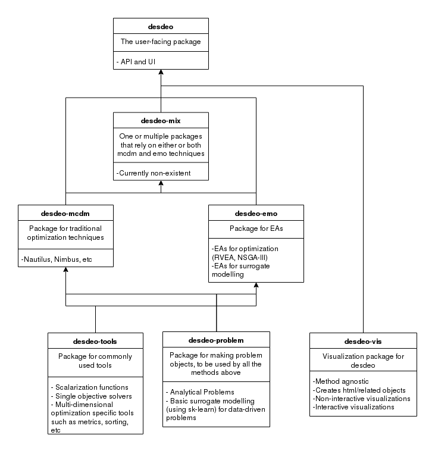

Software
========

Modular Structure
-----------------

The DESDEO framework consists of various modules defined as Python software
packages. The modular structure can be seen in the image below, and a short
description of the different packages follows. The descriptions contain
links to the invdividual documentation pages for each of the package.

desdeo-problem
^^^^^^^^^^^^^^

The desdeo_problem_ package contains tools and classes for defining and
modelling multiobjective optimization problems. The defined problem classes
can be used in the other packages in the DESDEO framework, such as
desdeo_mcdm_ and desdeo-emo (*coming soon*)

desdeo-tools
^^^^^^^^^^^^

The desdeo_tools_ package contains tools to facilitate different tasks in the
other packages in the DESDEO framework. These tools include, for example,
scalarization routines and various solvers.

desdeo-emo
^^^^^^^^^^

(*coming soon*) The desdeo_emo package contains evolutionary algorithms for solving multiobjective optimization problems.
These algorithms include, for example, interactive RVEA_.

desdeo-mcdm
^^^^^^^^^^^

The desdeo_mcdm_ package contains traditional methods for performing
interactive multiobjective optimization. These methods include, but are not
limited to, Synchronous NIMBUS_ and E-NAUTILUS_, for example.

desdeo-vis
^^^^^^^^^^

(*coming soon*) The desdeo_vis package contains tools for building visualizations.

desdeo-mix
^^^^^^^^^^

(*coming soon*) The desdeo_mix package contains routines and algorithms which
make use of the other packages in the DESDEO framework, and warrant their own
implementation to be included as part of the framework.

Installation
------------

To install a single package, see that package's documentation. To install
the whole DESDEO framework, follow one of the alternatives given below
according to the operating system on the machine you plan to install DESDEO
on.

Linux
^^^^^

The recommended way of installing the DESDEO framework is to use pip by invoking the command:
::

   pip install desdeo

For developing, usage of the poetry dependency management tool is
recommended. However, no framework code should be contributed to the main
DESDEO package. Instead, contributions should go to the relevant subpackage,
which are listed here. See the documentation for the individual for further
details. See `Modular Structure`_ for links to the individual documentations.

OSX
^^^

*Instruction coming eventually.*

Windows
^^^^^^^

*Instruction coming eventually.*

 .. _desdeo_mcdm: https://desdeo-mcdm.readthedocs.io/en/latest/

 .. _desdeo_problem: https://desdeo-problem.readthedocs.io/en/latest/

 .. _desdeo_tools: https://desdeo-tools.readthedocs.io/en/latest/

 .. _NIMBUS: https://www.sciencedirect.com/science/article/pii/S0377221704005260?via%3Dihub

 .. _E-NAUTILUS: https://www.sciencedirect.com/science/article/pii/S0377221715003203?via%3Dihub

 .. _RVEA: https://ieeexplore.ieee.org/document/7386636